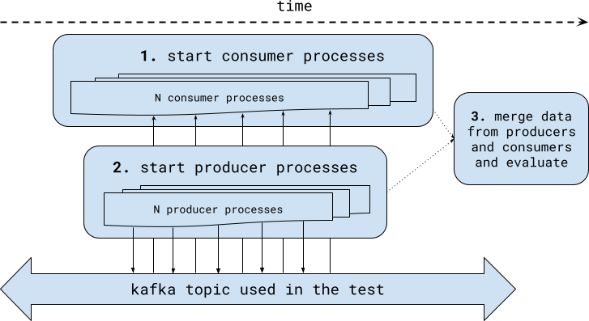

Kafka end-to-end perf test
==========================

Using multiple producers produce N messages to Kafka and using M consumers
consume them again and compute average message end-to-end time.


What the test does
------------------



Each message consists of a unique ID (UUID) and randomly generated payload
(same for all messages) to create a message 700 B big.

Every producer thread records message UUID, time when the message was sent
(when it was handed over to kafka-python library KafkaProducer object to
send it) and time when it was actually published (when "success" callback
was called by message "future" object).

Every consumer records a message UUID again, time when it was output to
the topic (using message.timestamp) and time when we actually consumed
it (when our code processed it).

Results module then compiles this information (to create a single data
source with UUID of every message and it's 4 timestamps) and computes
*sent range* (how long did it took to send all the messages - i.e. max(sent) - min(sent))
and similarly also *published range*, *output range* and *consumed range*.
It also computes *consumed-sent* (time taken for a message to be produced
by our producer to be consumed by our consumer - it provides mean, max
and various percentiles for this).

Note: `zmqrpc.py` was taken from https://github.com/locustio/locust as it provides handy abstraction. Thank you Locust team!


Installation
------------

Install with:

    python -m venv venv
    source venv/bin/activate
    pip install git+https://github.com/jhutar/kafka-e2e-perf-test.git

If you have cloned the git and want to develop locally, replace last step with:

    pip install --editable .


Simple usage
------------

```
$ kafka-e2e-perf-test.py --help
usage: kafka-e2e-perf-test.py [-h] [--leader-host LEADER_HOST]
                              [--leader-port LEADER_PORT]
                              [--leader-expect-offers LEADER_EXPECT_OFFERS]
                              [--kafka-bootstrap-host KAFKA_BOOTSTRAP_HOST]
                              [--kafka-bootstrap-port KAFKA_BOOTSTRAP_PORT]
                              [--kafka-topic KAFKA_TOPIC]
                              [--test-producer-processes TEST_PRODUCER_PROCESSES]
                              [--test-consumer-processes TEST_CONSUMER_PROCESSES]
                              [--test-produce-messages TEST_PRODUCE_MESSAGES]
                              [--producer-acks {0,1,all}] [-d]
                              {leader,follower,results}

Helper tool for Kafka e2e latency test

positional arguments:
  {leader,follower,results}
                        What shall we do?

optional arguments:
  -h, --help            show this help message and exit
  --leader-host LEADER_HOST
                        Where is our leader running? When started as a leader,
                        we listen on *.
  --leader-port LEADER_PORT
                        What is the leader port?
  --leader-expect-offers LEADER_EXPECT_OFFERS
                        How many offers should we expect (how many folowers)?
  --kafka-bootstrap-host KAFKA_BOOTSTRAP_HOST
                        What Kafka bootstrap server to connect to?
  --kafka-bootstrap-port KAFKA_BOOTSTRAP_PORT
                        What Kafka bootstrap server port to connect to?
  --kafka-topic KAFKA_TOPIC
                        What topic should we produce to and consume from?
  --test-producer-processes TEST_PRODUCER_PROCESSES
                        How many consumer processes should we start?
  --test-consumer-processes TEST_CONSUMER_PROCESSES
                        How many consumer processes should we start?
  --test-produce-messages TEST_PRODUCE_MESSAGES
                        How many messages should we produce in total (all
                        proceses together)?
  --producer-acks {0,1,all}
                        What acks setting should producer use?
  -d, --debug           Show debug output
```


Scaling horizontaly
-------------------

To be able to run the test with *lots* of producers and consumers, test
is able to scale horizontally (use more machines to run the producers
and consumers to distribute load). To be able to do this, you just follow
these steps:

1. First start the leader with `kafka-e2e-perf-test.py leader --leader-expect-offers N <any other option>` where N is number of follower nodes you plan to use
2. On other hosts that will act as a followers, start a follower with `kafka-e2e-perf-test.py follower --leader-host <leader node hostname>`

Leader node does not interact with Kafka, it just coordinates followers
and at the end it receives result data from them, so you use it to show
the results with `kafka-e2e-perf-test.py results` as it have complete data.
